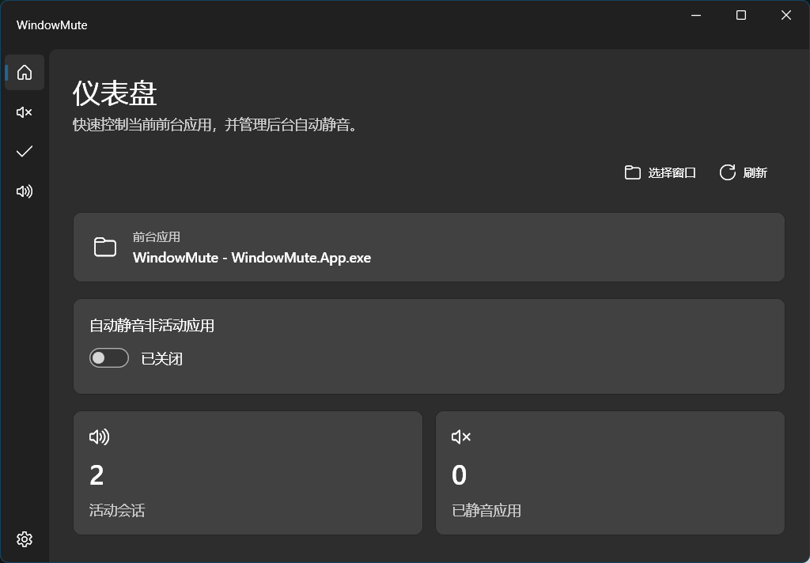
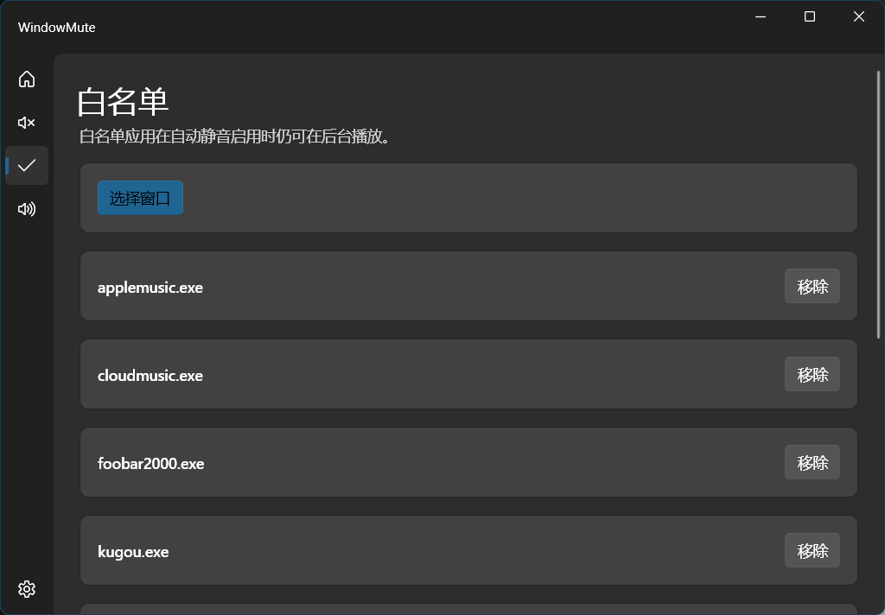
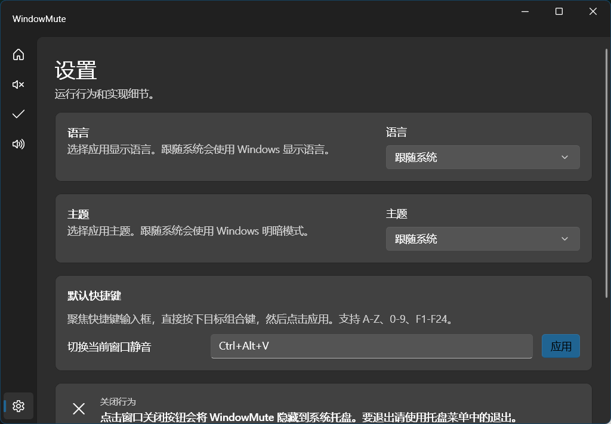

<p align="center">
  
</p>

<p align="center">
  简体中文 | <a href="README_en.md">English</a>
</p>

# 一个面向 Windows 11 的窗口静音工具

<p align="center">
  
  
  
  
  
</p>

WindowMute 是一个 Windows 桌面音量辅助工具。它可以通过快捷键、选择窗口或自动规则，让指定应用静音，并在窗口重新激活时恢复由本应用自动调整过的音频状态。

> 基于 Windows Core Audio session 工作：选择窗口后，实际控制的是该窗口所属应用的音频会话；同一进程的多个窗口可能会共同受影响。

## 产品截图

<p align="center">
  
</p>

<p align="center">
  
</p>

<p align="center">
  
</p>

## 项目特点

* 原生 Windows 11 体验：使用 WinUI 3 / Windows App SDK 构建，窗口、导航、托盘和提示尽量贴近 Fluent UI 风格。
* 快捷键控制：默认 `Ctrl+Alt+M` 切换当前前台窗口所属应用的静音状态。
* 选择窗口静音：点击“选择窗口”后，下一次鼠标点击的目标窗口会被切换静音状态。
* 自动静音非活动应用：启用后，只保留当前前台应用和白名单应用发声。
* 白名单机制：白名单只豁免自动静音，不覆盖用户手动静音。
* 音频会话管理：查看当前 Windows 音频 session，并支持静音和音量滑杆控制。
* 托盘常驻：关闭主窗口时隐藏到托盘，支持从托盘显示窗口、选择窗口、切换自动静音和退出。
* 本地配置：配置保存在 `%APPDATA%\WindowMute\config.json`，便于升级和排查。

## 项目定位

* Windows 11 桌面音频工作流辅助工具。
* 面向会议、直播、录屏、游戏、多媒体播放等多窗口场景。
* 不做驱动、不注入目标进程、不绕过 Windows 音频 session 模型。

## 功能清单

### 窗口与静音

* 当前前台窗口一键静音 / 取消静音。
* 鼠标选择任意窗口并切换静音。
* 手动静音与自动静音同时生效，手动静音优先级更高。
* 自动恢复只恢复本应用自动改动过的 session，不覆盖系统混音器中的用户手动设置。

### 自动静音

* 监听前台窗口变化。
* 启用后自动静音后台可控 session。
* 前台应用恢复时优先快速恢复声音。
* 支持白名单应用后台继续发声。

### 设置与界面

* 支持应用语言设置，默认跟随系统语言。
* 支持主题设置，默认跟随系统主题。
* 快捷键使用按键录入方式配置。
* 启动时检测快捷键占用；被占用时给出提示并跳转设置页。
* 悬浮提示跟随应用语言显示。

### 打包与分发

* 使用 unpackaged self-contained WinUI app。
* 使用 Inno Setup 6 构建单个安装包 exe。
* 安装包、应用 exe、标题栏、托盘和快捷方式使用统一图标。

## 目录结构

```text
.
├── installer/                  # Inno Setup 安装脚本
├── scripts/                    # 构建安装包脚本
├── src/WindowMute.App/         # C# WinUI 3 应用
│   ├── Assets/                 # 应用图标资源
│   ├── Core/                   # 配置与规则辅助逻辑
│   ├── Models/                 # UI 状态模型
│   └── Services/               # 音频、窗口、快捷键、选择、托盘等服务
└── tests/WindowMute.App.Tests/ # 单元测试
```

## 快速开始

### 环境要求

* Windows 11 x64
* .NET 10 SDK
* Windows App SDK 支持的桌面开发环境
* Inno Setup 6，用于构建安装包

### 构建应用

```powershell
dotnet build .\src\WindowMute.App\WindowMute.App.csproj -c Release
```

### 运行测试

```powershell
dotnet test .\tests\WindowMute.App.Tests\WindowMute.App.Tests.csproj
```

### 构建安装包

```powershell
.\scripts\build-installer.ps1 -Version 0.1.0 -StopRunningApp
```

构建完成后输出：

```text
artifacts\installer\WindowMuteSetup-0.1.0-x64.exe
```

### 构建完整发布产物

```powershell
.\scripts\build-release.ps1 -Version 0.1.0 -StopRunningApp
```

构建完成后输出：

```text
artifacts\release\WindowMute-0.1.0-win-x64-portable.zip
artifacts\release\WindowMuteSetup-0.1.0-x64.exe
```

## 默认快捷键

| 快捷键 | 功能 |
| --- | --- |
| `Ctrl+Alt+M` | 切换当前前台窗口所属应用静音 |

## 配置文件

```text
%APPDATA%\WindowMute\config.json
```

主要字段：

* `autoEnabled`：是否启用自动静音非活动应用。
* `whitelist`：自动静音白名单。
* `manualMuted`：用户手动静音的应用。
* `hotkeys.toggleForeground`：切换当前前台应用静音的快捷键。

## 当前限制

* Windows 音频控制以 Core Audio session 为边界，不是驱动级单窗口隔离。
* 同一进程下多个窗口可能共享同一个音频 session。
* 部分 UWP / 系统组件可能由宿主进程承载，显示名称和控制粒度取决于 Windows 暴露的信息。
