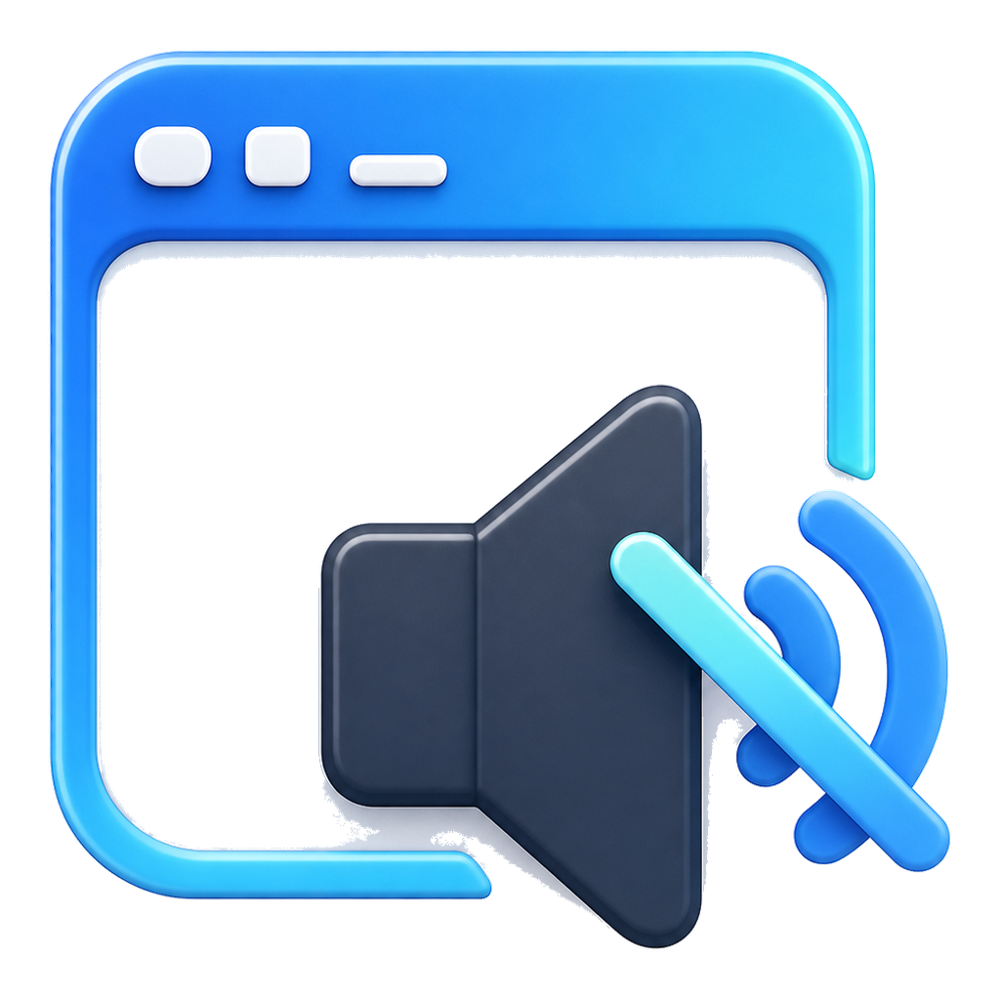

<p align="center">
  
</p>

<p align="center">
  <a href="README.md">简体中文</a> | English
</p>

# A Window Mute Utility For Windows 11

<p align="center">
  
  
  
  
  
</p>

WindowMute is a Windows desktop audio utility. It can mute selected applications through a hotkey, a window picker, or automatic foreground rules, and restore audio states that were changed by the app itself when a window becomes active again.

> works on top of Windows Core Audio sessions. When you select a window, WindowMute controls the audio session of that window's application. Multiple windows from the same process may be affected together.

## Project Features

* Native Windows 11 experience: built with WinUI 3 / Windows App SDK, with Fluent-style windowing, navigation, tray integration, and notifications.
* Hotkey control: `Ctrl+Alt+M` toggles mute for the current foreground window's application by default.
* Window selection: click "Select window", then click any target window to toggle its mute state.
* Automatic background mute: when enabled, only the foreground application and whitelisted applications are allowed to keep playing audio.
* Whitelist rules: the whitelist only bypasses automatic mute; it does not override manual mute.
* Audio session management: inspect current Windows audio sessions and control mute or volume per session.
* Tray resident behavior: closing the main window hides it to the tray. The tray menu can show the window, select a target window, toggle automatic mute, or exit.
* Local configuration: settings are stored in `%APPDATA%\WindowMute\config.json`.

## Project Positioning

* A desktop audio workflow helper for Windows 11.
* Designed for meetings, streaming, screen recording, gaming, media playback, and other multi-window scenarios.
* No drivers, no target-process injection, and no bypassing the Windows audio session model.

## Feature List

### Windows And Mute Control

* Toggle mute for the current foreground window's application.
* Select any window with the mouse and toggle its mute state.
* Manual mute and automatic mute work together; manual mute has higher priority.
* Automatic restore only restores sessions changed by WindowMute itself, without overwriting manual changes made in the Windows volume mixer.

### Automatic Mute

* Listens for foreground window changes.
* Automatically mutes controllable background sessions when enabled.
* Quickly restores the foreground application when it becomes active.
* Allows whitelisted applications to keep playing audio in the background.

### Settings And UI

* Supports app language selection; follows the system language by default.
* Supports theme selection; follows the system theme by default.
* Hotkeys are configured through key capture instead of plain text input.
* Detects hotkey conflicts on startup; when a conflict is found, it shows a notification and navigates to Settings.
* Floating notifications follow the selected app language.

### Packaging And Distribution

* Built as an unpackaged self-contained WinUI app.
* Uses Inno Setup 6 to produce a single setup executable.
* The setup executable, app executable, title bar, tray icon, and shortcuts share the same icon asset.

## Repository Layout

```text
.
├── installer/                  # Inno Setup script
├── scripts/                    # Installer build script
├── src/WindowMute.App/         # C# WinUI 3 application
│   ├── Assets/                 # App icon assets
│   ├── Core/                   # Configuration and rule helpers
│   ├── Models/                 # UI state models
│   └── Services/               # Audio, windowing, hotkey, selection, tray services
└── tests/WindowMute.App.Tests/ # Unit tests
```

## Quick Start

### Requirements

* Windows 11 x64
* .NET 10 SDK
* A desktop development environment compatible with Windows App SDK
* Inno Setup 6 for installer builds

### Build The App

```powershell
dotnet build .\src\WindowMute.App\WindowMute.App.csproj -c Release
```

### Run Tests

```powershell
dotnet test .\tests\WindowMute.App.Tests\WindowMute.App.Tests.csproj
```

### Build The Installer

```powershell
.\scripts\build-installer.ps1 -Version 0.1.0 -StopRunningApp
```

Output:

```text
artifacts\installer\WindowMuteSetup-0.1.0-x64.exe
```

### Build Full Release Assets

```powershell
.\scripts\build-release.ps1 -Version 0.1.0 -StopRunningApp
```

Output:

```text
artifacts\release\WindowMute-0.1.0-win-x64-portable.zip
artifacts\release\WindowMuteSetup-0.1.0-x64.exe
```

## GitHub Actions Release

The repository includes a `Build and Release` workflow with two trigger modes:

* Push a tag to publish automatically:

```powershell
git tag v0.1.0
git push origin v0.1.0
```

* Run `Build and Release` manually from the GitHub Actions page and enter a version.

Each release uploads two assets:

* `WindowMute-<version>-win-x64-portable.zip`: portable zip package.
* `WindowMuteSetup-<version>-x64.exe`: installer executable.

## Default Hotkey

| Hotkey | Action |
| --- | --- |
| `Ctrl+Alt+M` | Toggle mute for the current foreground window's application |

## Configuration

```text
%APPDATA%\WindowMute\config.json
```

Main fields:

* `autoEnabled`: whether automatic background mute is enabled.
* `whitelist`: applications excluded from automatic mute.
* `manualMuted`: applications manually muted by the user.
* `hotkeys.toggleForeground`: hotkey for toggling the foreground application's mute state.

## Current Limitations

* Audio control is bounded by Windows Core Audio sessions, not driver-level per-window isolation.
* Multiple windows from the same process may share the same audio session.
* Some UWP or system components may be hosted by shared processes; display names and control granularity depend on what Windows exposes.
